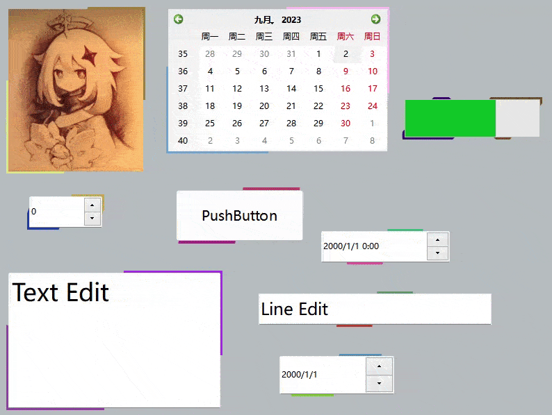

# Qt-widget-Fancy_UI🥳
花里胡哨的Ui😋😋，使用C++QT widget实现

<b>**Qt Creator 编译C++不支持中文路径！！！使用Qt Creator 编译时请确保没有任何中文路径！！！请手动修改文件夹名称**</b>

# 白天黑夜切换按钮🌤️🌙
## 效果

## 代码功能
编写中......😉
源码有详细注释，可以先看源码。😊

# 波纹效果按钮🐱
## 效果

## 代码功能
编写中......😉
源码有详细注释，可以先看源码。😊

# 动态边框效果😶‍🌫️
## 效果

## 代码功能
编写中......😉
源码有详细注释，可以先看源码😊

# 透明窗口+自定义标题栏
## 效果

## 代码功能
编写中......😉
源码有详细注释，可以先看源码😊
