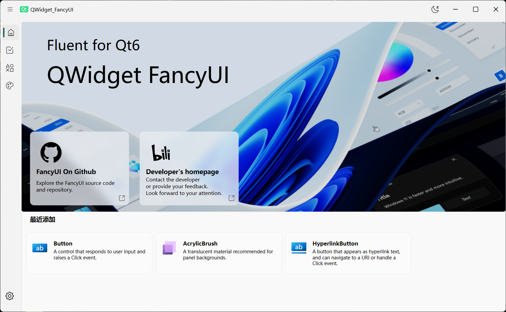
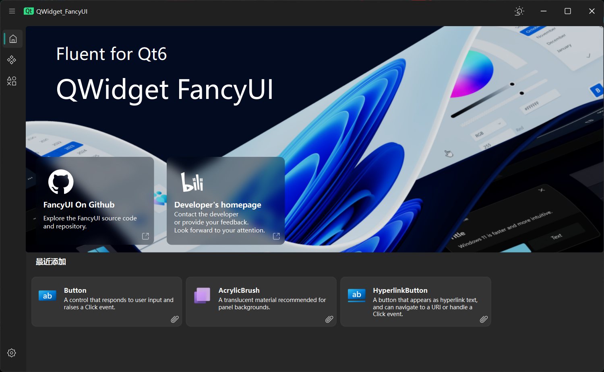
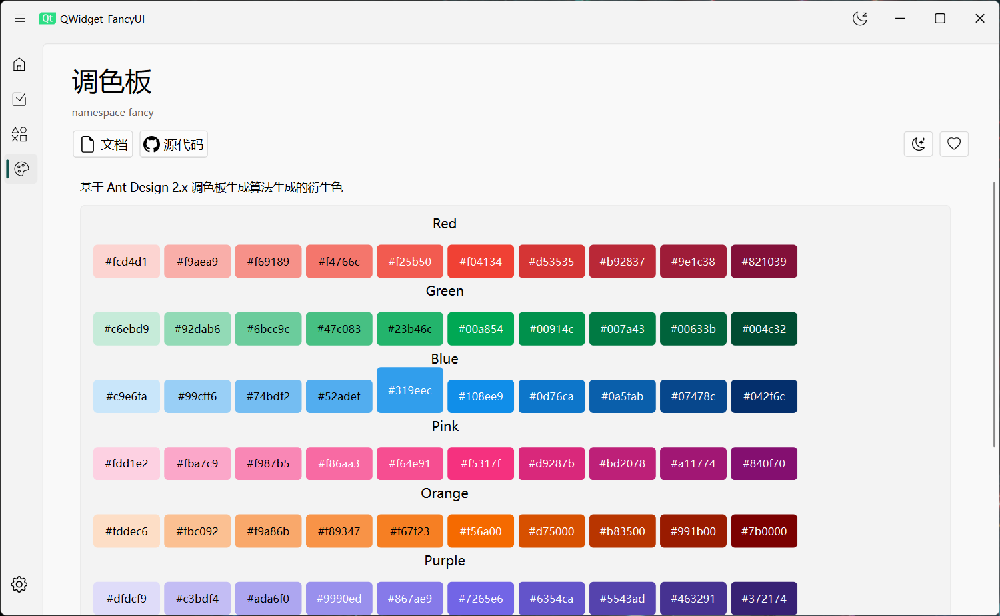
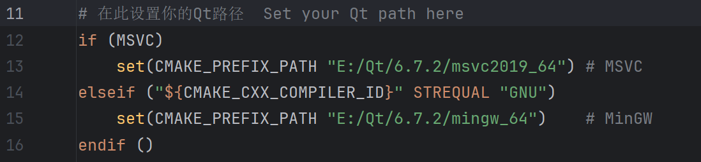

  <h1>FancyUi - Qt Widget</h1>

  
  
  
  

  
  <!--  -->
  
  

 简体中文 | <a href="./README_EN.md">English</a>

---

# 更新说明
- 目前正在进行全面重构更新，可编译示例程序先行体验
- 代码全面重构，更清晰、更易读…告别屎山🤔？
- 更多的图标：引入`IconPark`、`Ant Design` 和` Bootstrap` 图标，多达5400+图标支持
- 目前仅支持 Qt 6 和 Windows 系统，后续计划更新支持 Qt 5 、Linux、Android 和 WebAssembly支持
- 暂时移除了 OpenCV 支持、部分尚不完善的类/功能等
- 第三方库使用：~~[OpenCV](https://github.com/opencv/opencv)~~、[magic-enum](https://github.com/Neargye/magic_enum)、[IconPark](https://github.com/bytedance/iconpark)、[Bootstrap Icons](https://github.com/twbs/icons)、[Ant Design](https://github.com/ant-design/ant-design)
- 参考和致谢：[SAPC-APCA](https://github.com/Myndex/SAPC-APCA)、[apca-w3](https://github.com/Myndex/apca-w3)、[WinUI 3](https://github.com/microsoft/microsoft-ui-xaml)
- 不再使用 `QMake`，改为 `CMake`
- 移除了项目之外的旧文件和Python文件

---

# 预览

# 示例程序编译指南

在 `CMakeLists.txt` 中修改`Qt`路径，即可在 IDE（Visual Studio、QtCreator、Clion等）中直接开始编译！

---

最后编辑日期：2025-11-19	by @COLORREF

