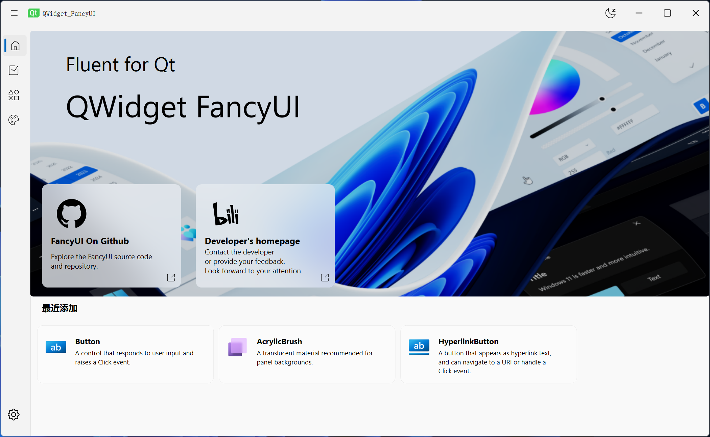
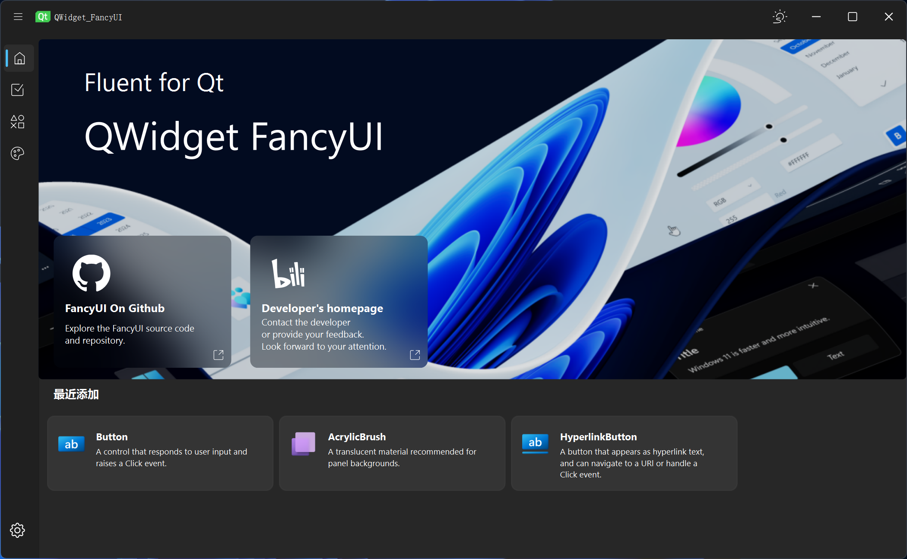
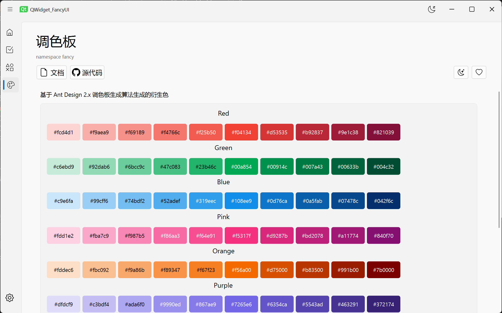
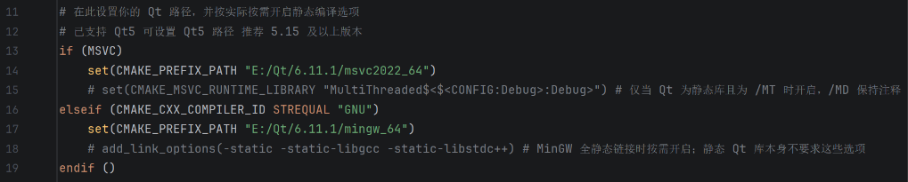

  <h1>FancyUi - Qt Widget</h1>

  
  
  
  

  
  <!--  -->
  
  

English | <a href="./README.md">简体中文</a>

---

# Update Notes

- A comprehensive refactor is currently in progress; the demo application is available for an early look.
- The codebase has been extensively refactored to make it cleaner and easier to read... goodbye, spaghetti code 🤔?
- Windows is currently the only supported platform; Linux, Android, and WebAssembly support is planned.
- Initial Qt 5 support has been added. Qt 5.15 or later is recommended; earlier versions have not been tested.
- Includes more than 5,400 icons from IconPark, Ant Design Icons, and Bootstrap Icons.
- Removed legacy files and Python files unrelated to the project.

---

# Preview

# Demo Program Build Guide

In the root `CMakeLists.txt`, follow the comments to set the Qt path, then build directly with Visual Studio, Qt Creator, CLion, or another supported IDE.

# Third-Party Projects, References, and Acknowledgements

- Used: [magic_enum](https://github.com/Neargye/magic_enum), [IconPark](https://github.com/bytedance/iconpark), [Bootstrap Icons](https://github.com/twbs/icons), [Ant Design Icons](https://github.com/ant-design/ant-design-icons)
- Referenced: [SAPC-APCA](https://github.com/Myndex/SAPC-APCA), [apca-w3](https://github.com/Myndex/apca-w3), [Ant Design Color System](https://2x.ant.design/docs/spec/colors), [WinUI 3](https://github.com/microsoft/microsoft-ui-xaml)
- Third-party projects and assets remain subject to their respective licenses.

---

Last edited: 2026-09-24　by @COLORREF
