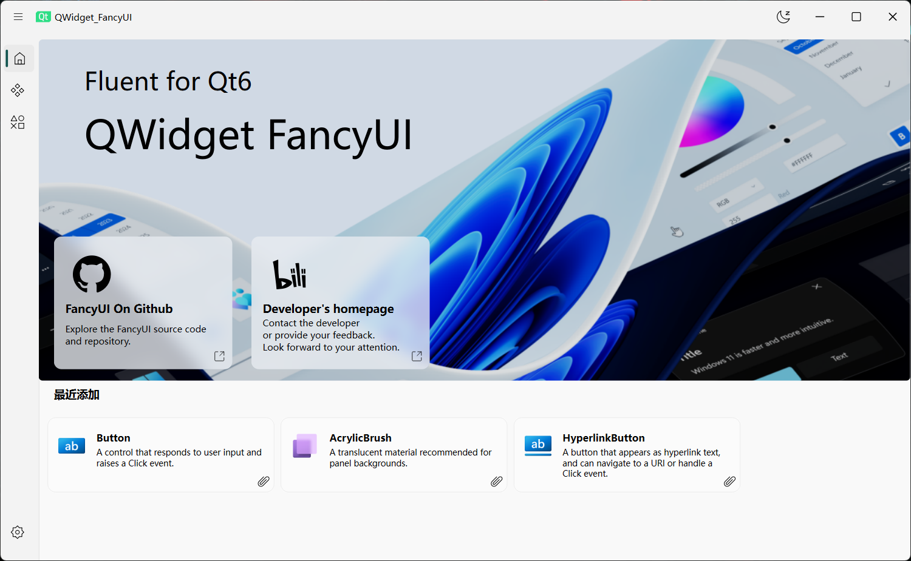
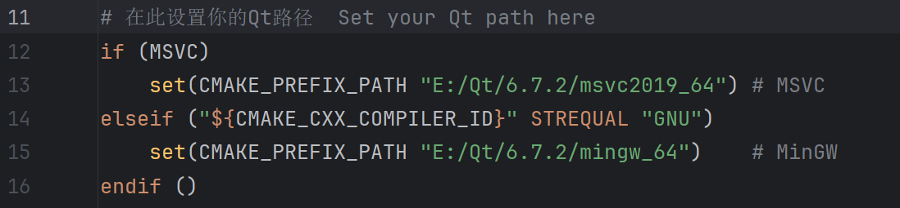

  <h1>FancyUi - Qt Widget</h1>

  
  
  
  

  
  <!--  -->
  
  

English | <a href="./README.md">简体中文</a>

---

# Update Notes
- A full-scale refactor and update is currently in progress. You can first try out the compilable demo program.
- Complete code refactoring — cleaner, more readable… saying goodbye to spaghetti code 🤔?
- More icons: integrated `IconPark`, `Ant Design`, and `Bootstrap` icon sets, with support for over 5400+ icons.
- Currently supports **Qt 6** and **Windows** only. Planned future updates will include support for **Qt 5**, **Linux**, **Android**, and **WebAssembly**.
- Compared to the previous version, **OpenCV** support and some incomplete classes/features have been temporarily removed.
- Third-party libraries used: ~~[OpenCV](https://github.com/opencv/opencv)~~, [magic-enum](https://github.com/Neargye/magic_enum), [IconPark](https://github.com/bytedance/iconpark), [Bootstrap Icons](https://github.com/twbs/icons), [Ant Design](https://github.com/ant-design/ant-design)
- References and acknowledgements: [SAPC-APCA](https://github.com/Myndex/SAPC-APCA), [apca-w3](https://github.com/Myndex/apca-w3), [WinUI 3](https://github.com/microsoft/microsoft-ui-xaml)
- Replaced `QMake` with `CMake`
- Removed legacy and external Python files from the project

---

# Preview

# Demo Program Build Guide

Modify the `Qt` path in `CMakeLists.txt`, then you can directly start building in your IDE (Visual Studio, QtCreator, Clion, etc.)!

---

Last edited: 2025-10-30 by @COLORREF
